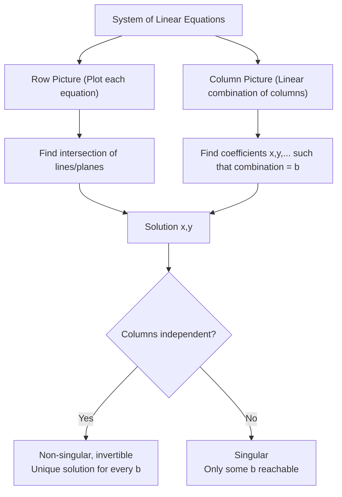

---
tags:
  - "#Mode/Alpha"
  - "#Course/18.06"
  - "#Status/Processed"
---
## 0. Obsidian Knowledge Scaffolding

### Learning Objectives
1. Interpret a system of linear equations via **row picture** (intersection of lines/planes) and **column picture** (linear combination of vectors).
2. Express a system in matrix form $A\mathbf{x} = \mathbf{b}$ and compute matrix-vector multiplication as a linear combination of columns.
3. Distinguish between **singular** (non-invertible) and **non-singular** matrices based on whether the columns fill the space.
4. Recognize that the fundamental problem is to solve $A\mathbf{x} = \mathbf{b}$ for **every** possible $\mathbf{b}$.

### Prerequisites
- Basic algebra, plotting lines in $\mathbb{R}^2$
- Vector addition and scalar multiplication (see [[Vectors and Geometry]])
- Familiarity with coordinate systems

### Synthesis Question
How does the column picture generalize the concept of solving $A\mathbf{x}=\mathbf{b}$ from two dimensions to $n$ dimensions, and why does linear independence determine solvability for **all** $\mathbf{b}$? (Hint: consider the notion of span.)

---

## 1. Prediction & Executive Summary

### Prediction Prompt (Pre-Learning)
- **What do you think this topic is about?**  the geometry of linear equations, probably what they represent. iirc its a plane intersection
- **What will be difficult?**  
visualizing should be easy but justifying why might be hard
- **Confidence (0–100%)**  
80%

### Executive Summary
Linear algebra begins with solving $n$ equations in $n$ unknowns. The lecture introduces three perspectives: 
- the **row picture** (lines/planes intersecting at a point), 
- the **column picture** (finding the right linear combination of column vectors to equal $\mathbf{b}$), and 
- the **matrix formulation** $A\mathbf{x} = \mathbf{b}$. 

The column picture reveals the fundamental operation: $\mathbf{b}$ must lie in the span of the columns. 

A matrix is non-singular (invertible) if its columns fill the whole space, guaranteeing a solution for every $\mathbf{b}$; otherwise, it is singular. Matrix-vector multiplication is defined as a linear combination of the columns. 

**Thesis:** The solvability of $A\mathbf{x}=\mathbf{b}$ hinges on whether the columns of $A$ span the target space – a geometric insight that unifies algebraic and visual reasoning.

---

## 2. Micro-Chunking

### 2.1 The Fundamental Problem
- **Goal:** Solve $n$ linear equations in $n$ unknowns.
- Example (2×2):
  $$
  \begin{aligned}
  2x - y &= 0 \\
  -x + 2y &= 3
  \end{aligned}
  $$
- **Priority:** 🔴 High Yield – cornerstone of the course.

### 2.2 Row Picture (Intersection of Lines/Planes)
- **Idea:** Plot each equation separately; the solution is the common intersection.
- **2D:** Each equation is a line. The solution $(1,2)$ lies where the two lines cross.
  - *Figure 1:* ![[Row_Picture_2D_Example.png]] (Placeholder: show lines $2x-y=0$ and $-x+2y=3$ intersecting at $(1,2)$).
  - Check: $2(1)-2=0$, $-1+4=3$ ✓.
- **3D:** Each equation is a plane; three planes meet at a point (if non-singular).
  - *Figure 2:* ![[Row_Picture_3D_Planes.png]] (Placeholder: three planes intersecting at a point).
- **Priority:** 🔴 High Yield (foundation).  
  **⚠️ Caution:** The row picture becomes messy in dimensions $n>3$ – the **column picture** scales better.

> [!CAUTION]+ Common Misconception
> **”Solving linear equations is just intersecting lines.”**  
> The row picture is intuitive, but it masks the algebraic core: the existence of a solution depends on whether $\mathbf{b}$ lies in the **span of the columns**, not merely on intersections. Even in 2D, parallel lines (no intersection) or coincident lines (infinitely many) correspond to singular matrices.

### 2.3 Column Picture (Linear Combination of Vectors)
- **Rewriting the system as a single vector equation:**
  $$
  x\begin{bmatrix} 2 \\ -1 \end{bmatrix} + y\begin{bmatrix} -1 \\ 2 \end{bmatrix} = \begin{bmatrix} 0 \\ 3 \end{bmatrix}
  $$
- **Interpretation:** Find the scalar multipliers $x,y$ such that the linear combination of the two column vectors equals the right-hand side vector $\mathbf{b}$.
- **Solution:** $x=1$, $y=2$ reproduces $\mathbf{b}$, because:
  $$
  1\cdot\begin{bmatrix}2\\-1\end{bmatrix} + 2\cdot\begin{bmatrix}-1\\2\end{bmatrix} = \begin{bmatrix}2-2\\ -1+4\end{bmatrix}= \begin{bmatrix}0\\3\end{bmatrix}
  $$
- **Geometrically:** Draw the two column vectors; by scaling them appropriately and adding tip-to-tail (parallelogram law), the result lands exactly on $\mathbf{b}$.
  - *Figure 3:* ![[Column_Picture_Combination.png]] (Placeholder: vectors $(2,-1)$ and $(-1,2)$ with parallelogram showing sum $(0,3)$).
- **Priority:** 🔴🔴 Highest Yield – this viewpoint pervades all of linear algebra.

### 2.4 The Matrix Form & Matrix-Vector Multiplication
- **Matrix form:**
  $$
  A = \begin{bmatrix} 2 & -1 \\ -1 & 2 \end{bmatrix},\quad \mathbf{x} = \begin{bmatrix} x \\ y \end{bmatrix},\quad \mathbf{b} = \begin{bmatrix} 0 \\ 3 \end{bmatrix}
  $$
  $$A\mathbf{x} = \mathbf{b}$$
- **How to compute $A\mathbf{x}$ – Two equivalent ways:**
  1. **Column way (preferred):** $A\mathbf{x} = x_1(\text{col}_1) + x_2(\text{col}_2) + \cdots$  
     *Example:* $\begin{bmatrix}2 & 5\\1 & 3\end{bmatrix}\begin{bmatrix}1\\2\end{bmatrix} = 1\begin{bmatrix}2\\1\end{bmatrix} + 2\begin{bmatrix}5\\3\end{bmatrix} = \begin{bmatrix}12\\7\end{bmatrix}$.
  2. **Row way (dot product):** Each row of $A$ dotted with $\mathbf{x}$.
- **Key insight:** **$A\mathbf{x}$ is a linear combination of the columns of $A$.** This thinking will be reused for matrix-matrix multiplication later.
- **Priority:** 🔴 High Yield.

### 2.5 Singular vs. Non-Singular (The Big Question)
- **Question:** Can we solve $A\mathbf{x}=\mathbf{b}$ for **every** $\mathbf{b}$?
- **Answer depends on the columns of $A$:**
  - **Non-singular (invertible):** The columns are **linearly independent**; their combinations fill the whole space. Every $\mathbf{b}$ is reachable.
  - **Singular:** The columns are **linearly dependent** (e.g., one column is a multiple/sum of the others). The combinations lie in a subspace (a line in 2D, a plane in 3D). Only $\mathbf{b}$ in that subspace can be solved.
- **Example of singular matrix:** $A = \begin{bmatrix}2 & -2\\ -1 & 1\end{bmatrix}$ (second column = –first column). The column picture spans only a line.
- **Priority:** 🔴🔴 Highest Yield – defines the solvability condition.

### 2.6 Recitation: Another Worked Example
- System: 
  $$
  \begin{cases}
  2x + y = 3 \\
  x - 2y = -1
  \end{cases}
  $$
- **Solve algebraically:** substitute $x = 2y-1$ from the second equation → $5y-2=3$ → $y=1$, $x=1$.
- **Row picture:** Lines $2x+y=3$ and $x-2y=-1$ intersect at $(1,1)$.
  - *Figure 4:* ![[Recitation_Row_Picture.png]] (Placeholder)
- **Column picture:** 
  $$
  x\underbrace{\begin{bmatrix}2\\1\end{bmatrix}}_{\mathbf{v}_1} + y\underbrace{\begin{bmatrix}1\\-2\end{bmatrix}}_{\mathbf{v}_2} = \begin{bmatrix}3\\-1\end{bmatrix}
  $$
  $x=1$, $y=1$ works; the parallelogram confirms the sum is $(3,-1)$.
- **Matrix form:** $A = \begin{bmatrix}2 & 1 \\ 1 & -2\end{bmatrix}$, $\mathbf{x} = \begin{bmatrix}x\\y\end{bmatrix}$, $\mathbf{b} = \begin{bmatrix}3\\-1\end{bmatrix}$.  
  Later we’ll see that $A^{-1}\mathbf{b}$ gives the solution directly if $A^{-1}$ exists.
- **Priority:** 🟡 Medium Yield (reinforcement of core ideas).

### ⚠️ Gap Handling
- **What about systems with no solution or infinitely many?** (Singular cases) – fully treated in subsequent lectures.
- **How to find the solution systematically for large $n$?** → Next lecture: **Elimination**.

---

## 3. Reference Tables

### Concept Table
| Term | Definition (Plain English) | Technical / Why It Matters | Interdisciplinary Link |
|------|----------------------------|-----------------------------|-------------------------|
| Linear Equation | An equation whose graph is a straight line (2D) or plane/hyperplane ($n$D). | $a_1x_1 + \dots + a_nx_n = b$; coefficients determine orientation. | Physics: force equilibrium; Economics: budget lines. |
| System of Linear Equations | A set of such equations that must hold together. | $A\mathbf{x}=\mathbf{b}$; fundamental model in science/engineering. | Circuit analysis, chemical balances, data fitting. |
| Row Picture | Intersection of the geometric objects (lines/planes) from each equation. | Visual in 2D/3D, but impractical for high dimensions; reveals solution as common point. | Geometry. |
| Column Picture | Viewing the system as a linear combination of the columns of $A$ that equals $\mathbf{b}$. | Exposes the span of the columns; determines solvability for all $\mathbf{b}$. | Machine learning: feature combinations; Physics: vector addition. |
| Matrix-Vector Multiplication $A\mathbf{x}$ | Combining the columns of $A$ using the entries of $\mathbf{x}$ as weights. | $A\mathbf{x} = x_1\mathbf{a}_1 + \cdots + x_n\mathbf{a}_n$; the core operation. | Computer graphics: transformations; Economics: input-output models. |
| Linear Combination | Sum of scalar multiples of vectors. | The fundamental building block of vector spaces. | Any quantitative field. |
| Singular Matrix | A square matrix whose columns are linearly dependent; does not have an inverse. | $\det(A)=0$; not every $\mathbf{b}$ yields a solution; solutions not unique if they exist. | Statistics: multicollinearity leads to unstable estimates. |
| Non-Singular Matrix | A square matrix with independent columns; invertible. | Unique solution for every $\mathbf{b}$; determinant non-zero. | Control theory, structural engineering. |

### Symbol Table
| Symbol | Meaning | Units | Typical Value (Example) |
|--------|--------|-------|--------------------------|
| $A$ | Coefficient matrix ($m \times n$) | dimensionless (real entries) | $\begin{bmatrix}2 & -1\\ -1 & 2\end{bmatrix}$ |
| $\mathbf{x}$ | Vector of unknowns | depends on context | $\begin{bmatrix}x\\y\end{bmatrix}$ |
| $\mathbf{b}$ | Right-hand side vector | depends on context | $\begin{bmatrix}0\\3\end{bmatrix}$ |
| $\mathbf{a}_i$ | $i$-th column of $A$ | – | $\begin{bmatrix}2\\-1\end{bmatrix}$ |
| $n$ | Number of equations/unknowns | count | 2, 3, … |

---

## 4. Active Recall (Anki)

### High-Yield Question Set
~~~csv
Question,Answer,Tags
"How do you interpret the row picture for a 2×2 system?","Two straight lines; their intersection point (x,y) solves both equations.","#18.06 #row_picture #conceptual"
"What is the column picture for the system: 2x - y = 0, -x + 2y = 3?","It asks for x and y such that $x\begin{bmatrix}2\\-1\end{bmatrix} + y\begin{bmatrix}-1\\2\end{bmatrix} = \begin{bmatrix}0\\3\end{bmatrix}$. The solution is x=1, y=2.","#18.06 #column_picture #application"
"Why is the matrix $A = \begin{bmatrix}2 & -2\\ -1 & 1\end{bmatrix}$ singular?","Its columns are multiples of each other (second = -first), so they lie on the same line. Linear combinations cannot reach any vector off that line.","#18.06 #singular #failure_mode"
"Explain matrix-vector multiplication $A\mathbf{x}$ using columns. Use $A=\begin{bmatrix}2&5\\1&3\end{bmatrix}$, $\mathbf{x}=(1,2)$.","$A\mathbf{x} = 1\begin{bmatrix}2\\1\end{bmatrix} + 2\begin{bmatrix}5\\3\end{bmatrix} = \begin{bmatrix}12\\7\end{bmatrix}$. It is a linear combination of the columns of A.","#18.06 #matrix_vector #application"
"TEACH-IT-BACK: You are tutoring a beginner. Describe the column picture for solving $2x+y=3$, $x-2y=-1$ as a story with arrows. Why does x=1, y=1 work?","Imagine you have a red arrow (2,1) and a blue arrow (1,-2). You can stretch or shrink them. You want to end up at the target point (3,-1). If you use one red arrow and one blue arrow, place them tip-to-tail: from origin go along red to (2,1), then from that tip add blue (1,-2) to reach (3,-1). That means x=1 copy of red, y=1 copy of blue. It works because the net movement sums exactly to the target.","#18.06 #teach_it_back #column_picture"
"If all three columns of a 3×3 matrix lie in the same plane, what can you say about solutions to $A\mathbf{x}=\mathbf{b}$?","The matrix is singular. Only $\mathbf{b}$ that lie in that plane can be reached; for $\mathbf{b}$ outside the plane there is no solution.","#18.06 #singular #conceptual"
~~~

---

## 5. Visual Traces

### Mermaid.js Diagram – Solving Pathways

*(Labels with commas or parentheses must be quoted.)*

---

## 6. Core Compression (Mandatory)

- **1 Core Idea:**  
	  The solvability of $A\mathbf{x}=\mathbf{b}$ for every $\mathbf{b}$ is determined by whether the columns of $A$ span the whole space – i.e., whether they are linearly independent.

- **1 Anchor Representation:**  
  $$A\mathbf{x} = x_1 \mathbf{a}_1 + x_2 \mathbf{a}_2 + \dots + x_n \mathbf{a}_n = \mathbf{b}$$

- **1 Critical Mistake:**  
  Assuming that just because each column is non-zero, any $\mathbf{b}$ can be reached. Linear dependence can trap the combinations in a subspace, making many $\mathbf{b}$ unreachable.

---

## 7. Gamma Layer (Opportunity Architect)

**Status:** ❌ Not Activated  
*Reason: This is a pure conceptual foundation lecture without immediate workflow inefficiencies, manual repetition, or automation potential. Gamma will be revisited when studying elimination and actual computation pipelines.*

---

## 8. Post-Study Hook

After studying this note, answer:

- **What still feels unclear?**  
  [Your answer: e.g., how to detect linear dependence without graphing, or the connection to the determinant.]
- **Can you solve the examples without looking?**  
  [Your answer: e.g., Yes, I can now re-derive the column picture and check singularity.]
- **Where would you hesitate if asked to solve a new 3×3 by the column picture alone?**  
  [Your answer: e.g., Deciding quickly if the three columns span $\mathbb{R}^3$ without computing.]

Then run the **Reality Auditor** (next section).

---

## --- Reality Auditor (Separate Prompt – Use AFTER Studying) ---

### ROLE: Reality Auditor

#### My Experience:
- **What felt easy:** [User fills in]
- **What felt confusing:** [User fills in]
- **What I got wrong:** [User fills in]
- **Time spent:** [User fills in]

#### Mismatch Detection
1. Compare your initial prediction (Confidence) with your actual performance. Where was the gap?
2. Identify any point where the lecture’s language differed from your internal mental model.

#### Failure Point Analysis
- List one problem or concept you could NOT explain to a peer. Why did that happen?

#### Hidden Assumptions
- What did the lecture assume you already knew? (e.g., comfort with plotting, vector addition)

#### Targeted Fixes (max 3)
1. 
2. 
3. 

#### Re-Compression
- Sharpen the core idea of the lecture into a new, even tighter sentence based on your reflection:
  [Your refined core idea]

*(Return to your main note and update Core Compression if needed.)*