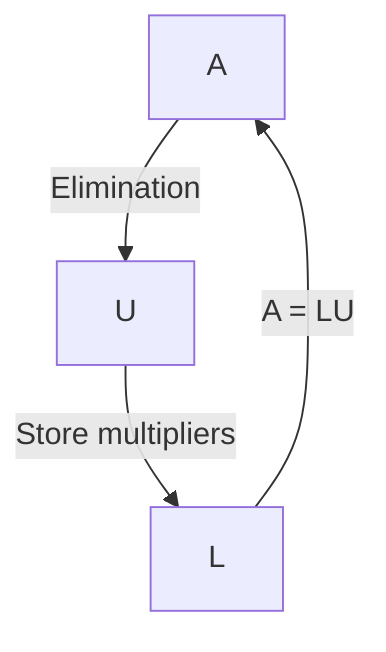

**Mode:** #Mode/Alpha #Course/LinearAlgebra #Topic/AequalsLU #Status/Processed  
**Prerequisites:** [[Elimination and Back Substitution]] | [[Matrix Multiplication]] | [[Inverse of a Matrix]]  
**Learning Objectives:**  
1. Derive $A = LU$ from elementary elimination matrices and explain why $L$ stays clean.  
2. Interpret $A=LU$ as a row‑combination statement: each row of $A$ is built from rows of $U$ with coefficients from $L$.  
3. Solve $Ax = b$ using forward and backward triangular solves after factoring $A$.  
4. Count operations: $\frac13 n^3$ for factoring, $n^2$ for each subsequent solve.  
5. Recognize when $A=LU$ fails (zero pivots) and understand the role of permutation matrices $P$.  

**Synthesis Question:**  
How does the $O(n^3)$ cost of dense $LU$ factorization shape algorithm design in large‑scale simulations, and why is sparsity exploited?

---

## Executive Summary

1. Elimination factors a matrix $A$ into a lower‑triangular $L$ (multipliers) and an upper‑triangular $U$ (pivots).  
2. The product of elimination matrices $E_{ij}$ mixes the multipliers; their inverses, taken in reverse order, form $L$ with multipliers sitting untouched – this is why $L$ is clean.  
3. The true meaning of $A = LU$ is that each row of $A$ is a linear combination of the rows of $U$, with the coefficients sitting in the corresponding row of $L$.  
4. Once $A$ is factored, solving $Ax = b$ reduces to two triangular systems ($Lc = b$, then $Ux = c$), cutting the cost from $O(n^3)$ to $O(n^2)$ for every new right‑hand side.  
5. When a zero pivot appears, $A=LU$ requires a row exchange, introducing a permutation matrix $P$ to give $PA = LU$.  

**Thesis:** $A=LU$ is the fundamental factorization that turns elimination into an algebraic record, separates the expensive one‑time decomposition from cheap triangular solves, and reveals how rows of $U$ combine to rebuild $A$.

---

## 1. Two Essential Rules

Before we factor, two patterns that always reverse order.

**Inverse of a product** – socks then shoes: undo by removing shoes first.  
$(AB)^{-1} = B^{-1}A^{-1}.$

**Transpose of a product** – flip order:  
$(AB)^T = B^T A^T,\qquad (A^{-1})^T = (A^T)^{-1}.$

# ***justify this:***

> [!CAUTION]+ Common Misconception  
> The order always reverses: $(AB)^T \neq A^T B^T$. Transpose of the inverse is the inverse of the transpose.
why?

---

## 2. From $A$ to $U$ and Back – The 2×2 Story

Elimination on $A = \begin{pmatrix}2 & 1 \\ 8 & 7\end{pmatrix}$:  
Subtract $4\times$ row 1 from row 2.  
The operation is a matrix:
$$E_{21} = \begin{pmatrix}1 & 0 \\ -4 & 1\end{pmatrix},\quad U = \begin{pmatrix}2 & 1 \\ 0 & 3\end{pmatrix}.$$
The multiplier $l_{21}=4$ appears with a minus sign in $E_{21}$.

To undo, add back the same multiple – the inverse has a plus sign:
$$E_{21}^{-1} = \begin{pmatrix}1 & 0 \\ 4 & 1\end{pmatrix} = L.$$
Thus $A = L U$:
$$\begin{pmatrix}2 & 1 \\ 8 & 7\end{pmatrix} = \begin{pmatrix}1 & 0 \\ 4 & 1\end{pmatrix} \begin{pmatrix}2 & 1 \\ 0 & 3\end{pmatrix}.$$

**ELI5:** Elimination tears rows apart; $L$ is the instruction sheet that glues them back together by adding multiples of upper rows.

---

## 3. Three‑by‑Three Magic – Why $L$ Is Clean, $E$ Is Not

Now three elimination steps: $E_{21}$ subtracts $2\times$ row 1 from row 2, $E_{31}=I$ (already zero), $E_{32}$ subtracts $5\times$ the *new* row 2 from row 3. The product $E = E_{32}E_{31}E_{21}$ is:
$$\begin{pmatrix}1&0&0\\ -2&1&0\\ 10&-5&1\end{pmatrix}.$$
Notice the $10$ – the two subtractions interacted: $2$ from row 2 then $5$ of that removed from row 3.

But take the inverses in reverse order, and each multiplier stays in its own spot:
$$L = E_{21}^{-1}E_{31}^{-1}E_{32}^{-1} = \begin{pmatrix}1&0&0\\ 2&1&0\\ 0&0&1\end{pmatrix}\begin{pmatrix}1&0&0\\ 0&1&0\\ 0&5&1\end{pmatrix} = \begin{pmatrix}1&0&0\\ 2&1&0\\ 0&5&1\end{pmatrix}.$$
The $10$ is gone; $L$ stores exactly the multipliers $2$ and $5$ without interaction.

**The row‑combination secret (Strang’s key insight):**  
Look at the third row of $A$ after elimination. It was rebuilt as:
$$\text{Row}_3(A) = \text{Row}_3(U) + 0\cdot\text{Row}_1(U) + 5\cdot\text{Row}_2(U).$$
The coefficients $(0,5,1)$ are precisely the third row of $L$. In general,
> Each row of $A$ is a linear combination of the rows of $U$, and the multipliers in $L$ are the coefficients.

This is why $A=LU$ is the “right way” to see elimination: it transforms a procedural sequence into an algebraic identity.

---

## 4. Using $LU$ to Solve $Ax = b$ — The Payoff

Given $A = LU$, the system $Ax = b$ splits into two easy triangular systems:
1. **Forward elimination:** $Lc = b$ (solve for $c$ top‑down).  
2. **Back substitution:** $Ux = c$ (solve for $x$ bottom‑up).

### Worked Example
$$A = \begin{pmatrix}2&1&0\\1&2&1\\0&1&2\end{pmatrix},\quad b = \begin{pmatrix}5\\7\\11\end{pmatrix}.$$
First factor $A$: multipliers $l_{21}=1/2$, $l_{32}=2/3$.
$$L = \begin{pmatrix}1&0&0\\1/2&1&0\\0&2/3&1\end{pmatrix},\quad U = \begin{pmatrix}2&1&0\\0&3/2&1\\0&0&4/3\end{pmatrix}.$$
Forward solve $Lc = b$:
$$\begin{aligned}
c_1 &= 5,\\
\tfrac12c_1 + c_2 &= 7 \;\Rightarrow\; c_2 = 4.5,\\
\tfrac23c_2 + c_3 &= 11 \;\Rightarrow\; c_3 = 8.
\end{aligned}$$
Back solve $Ux = c$:
$$\begin{aligned}
\tfrac43x_3 &= 8 \;\Rightarrow\; x_3 = 6,\\
\tfrac32x_2 + x_3 &= 4.5 \;\Rightarrow\; x_2 = -1,\\
2x_1 + x_2 &= 5 \;\Rightarrow\; x_1 = 3.
\end{aligned}$$
Check: $Ax = b$ holds.

**Why this matters:** The $O(n^3)$ factorization is done once; each new $b$ only needs $O(n^2)$ work. That’s the secret of efficient computing.

# Justify big O

---

## 5. The Cost of Elimination

How many operations for an $n \times n$ matrix?  
- First column: about $n^2$ multiply‑subtract operations.  
	- justify why n^2
- Second column: $(n-1)^2$, and so on.

Total $\approx \sum_{k=1}^n k^2 \approx \int_0^n x^2\,dx = \frac13 n^3$.

think of it as a pyramid

The right‑hand side costs only $n^2$ — negligible by comparison.

> **ELI5:** Cleaning an $n \times n$ grid costs $\frac13 n^3$ moves; once cleaned, you can answer new questions with just $n^2$ moves.

---

## 6. When Pivots Vanish – Permutations

If a pivot is zero, $A=LU$ fails. Example:
$$A = \begin{pmatrix}0&1\\1&1\end{pmatrix}.$$
We cannot clear below the $(1,1)$ entry without swapping rows. Multiply by a permutation matrix:
$$P = \begin{pmatrix}0&1\\1&0\end{pmatrix},\quad PA = \begin{pmatrix}1&1\\0&1\end{pmatrix} = U.$$
Now $PA = LU$ with $L=I$.

**Key facts:** $P^{-1} = P^T$. For $n\times n$ there are $n!$ permutation matrices; they form a group.

---

## 7. Reference Tables

### Concept Table

| Term | Plain English | Technical / Why It Matters | Interdisciplinary Link |
|------|--------------|---------------------------|-----------------------|
| **$A=LU$** | Writing $A$ as product of a lower‑triangular $L$ (multipliers) and an upper‑triangular $U$ (pivots). | Encodes elimination; $L$ is the inverse of the $E$’s in reverse order. Separates factorization from solving. | Circuit simulation, finite elements – any place we solve $Ax=b$ repeatedly. |
| **Row‑combination view** | Each row of $A$ is a sum of rows of $U$, weighted by the entries in $L$. | Makes $L$ meaningful: it tells exactly how to rebuild $A$ from $U$. | Equivalent to the matrix‑matrix multiplication view; useful in factor analysis. |
| **Multiplier $l_{ij}$** | Number multiplied to pivot row $j$ before subtracting from row $i$. | Stored directly in $L$ at $(i,j)$; avoids creating mixed terms. | In numerical libraries, multipliers are stored in place of zeros to save memory. |
| **Permutation $P$** | Matrix with a single 1 per row and column; swaps rows when multiplied on left. | Required when a zero pivot occurs; $PA = LU$ is the general form. | Graph reordering, bandwidth reduction, sparse matrix optimization. |
| **Operation count $\frac13 n^3$** | Total multiply‑subtract operations for full $LU$ factorization. | Governs feasibility for large systems; motivates sparse and iterative methods. | Complexity analysis, parallel computing, big‑data algorithms. |

### Symbol Table

| Symbol | Meaning | Typical Value / Note |
|--------|---------|---------------------|
| $A$ | Original square matrix | Invertible, no zero pivots for $A=LU$ |
| $L$ | Lower‑triangular (1s on diagonal) | Multipliers $l_{ij}$ below diagonal |
| $U$ | Upper‑triangular (pivots on diagonal) | Result of elimination |
| $E_{ij}$ | Elimination matrix (subtracts $l_{ij}\times$ row $j$ from row $i$) | Identity with $-l_{ij}$ at $(i,j)$ |
| $P$ | Permutation matrix | $P^{-1}=P^T$ |
| $n$ | Matrix dimension | $n\ge 1$ |

---

## 8. Active Recall (Anki + Teach‑it‑back)

```csv
Question,Answer,Tags
"Why does $(AB)^{-1}=B^{-1}A^{-1}$ and not $A^{-1}B^{-1}$?","The inner $BB^{-1}$ must collapse first. (Socks‑shoes rule.)",#inverse
"Give the LU factorization of [[2,1],[8,7]].","$L=[[1,0],[4,1]]$, $U=[[2,1],[0,3]]$.",#LU
"In A=LU, why does L have 1's on diagonal?","Each $E^{-1}$ has 1's on diagonal; product of unit lower triangular matrices keeps that property.",#LU
"What is the row-combination statement for a 3×3 LU?","Row i of A = Row i of U + sum_{j<i} l_{ij} (Row j of U).",#LU #intuition
"How many operations to factor an n×n dense matrix?","~ (1/3)n^3 multiply-subtracts.",#complexity
"If the first pivot is zero, can we still have A=LU?","No; need a row exchange, so PA=LU.",#LU #pivot
"Solve Ax=b for A=[[2,1,0],[1,2,1],[0,1,2]] and b=(5,7,11) using LU.","c=(5,4.5,8), x=(3,-1,6).",#LU #solve
"What does L tell you geometrically or structurally?","It tells how many of each row of U to add to get each row of A – it’s a recipe for reconstruction.",#LU #intuition
```


**Teach‑it‑back challenge:**  
Explain to a friend why $L$ has no “10” in the 3×3 example but $E$ does. Then show them how the rows of $A$ are just sums of rows of $U$ with weights from $L$. (3–5 sentences.)

---

## 9. Visual Traces

### Mermaid: The A=LU Flow (3×3, no row exchanges)



*Figure: Forward elimination produces $U$; the reverse path, via inverses in opposite order, gives $L$ and reconstructs $A$.*

---

## 10. Core Compression

- **1 Core Idea:** $A = LU$ is elimination in algebraic form; $L$ stores multipliers cleanly because the inverses are multiplied in reverse order, and the rows of $A$ are simple combinations of rows of $U$ with coefficients from $L$.  
- **1 Anchor Representation:**  
  $$A = LU,\quad L = \prod_{i>j} E_{ij}^{-1}\text{ (reverse order)},\quad \text{Row}_i(A) = \text{Row}_i(U) + \sum_{j<i} l_{ij}\,\text{Row}_j(U).$$  
- **1 Critical Mistake:** Multiplying the $E$ matrices in the same order and thinking that gives $L$ – it gives a messy $E$ with filled‑in entries like the 10. Always reverse the order and invert each $E$ to get $L$.

---

## 11. Post‑Study Hook

After reviewing, answer:

- **What still feels unclear?** [User fills in]  
- **Can you solve a new 3×3 system using LU without looking?** [User fills in]  
- **Where would you hesitate?** [User fills in]  

---

## 12. Gamma Layer (Optional: From Theory to Automation)

*Activate only after Core Compression is solid and no major gaps remain.*

**Pain Point:** Re‑factoring $A$ for every new right‑hand side wastes $O(n^3)$ effort.  
**Bottleneck:** Casual users call `solve(A,b)` in a loop without caching $LU$.  
**Automation Potential:** Build a simple wrapper that factors once and reuses $L$ and $U$; expose a `.solve(b)` method.  
**Leverage Score:** 9/10 – turns intractable workflows into routine ones.  
**Build Hook:** A Python class `MemoizedSolver` that stores the `lu` output and provides a `solve` method with progress bar for large matrices.  
**Why hasn’t this been fully solved?** Professional libraries already do this, but user habit and educational gaps keep the inefficient pattern alive. Better defaults and teaching could bridge the gap.
