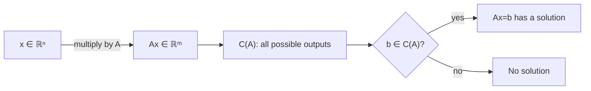
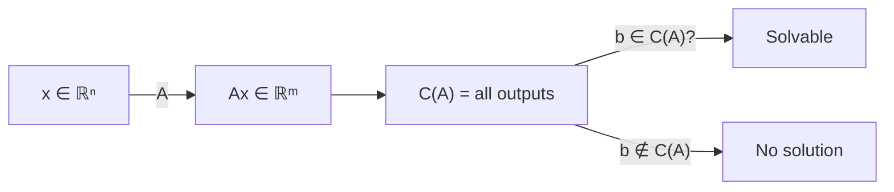
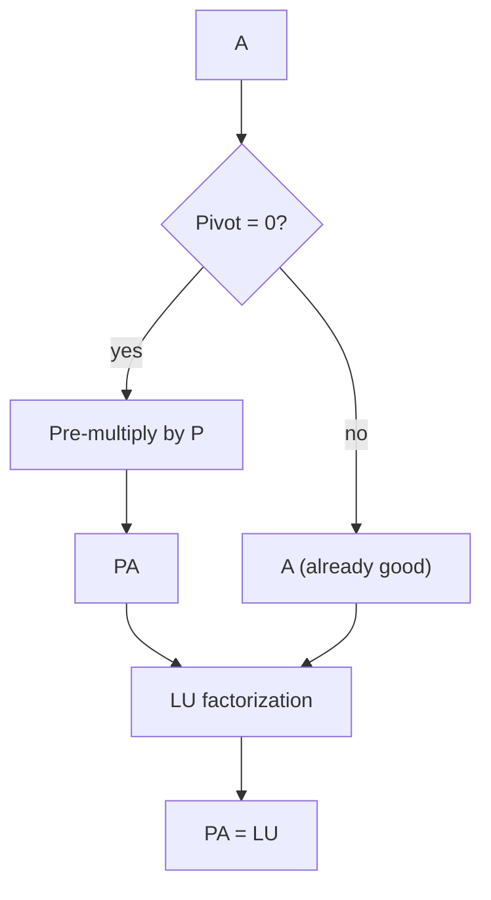
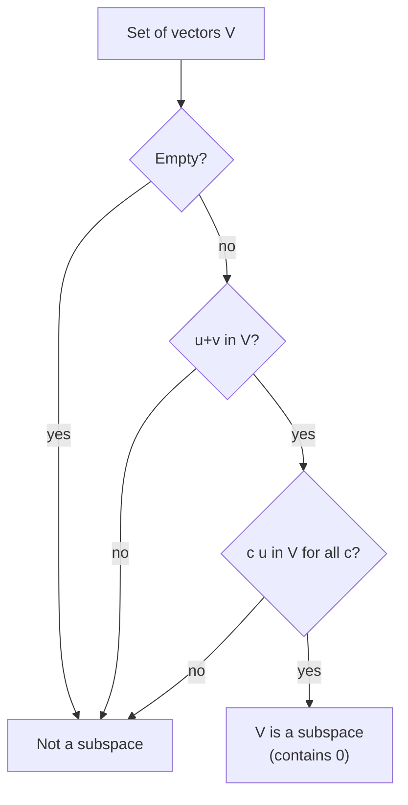

---
tags:
  - "#Mode/Alpha"
  - "#Mode/Beta"
  - "#Course/LinearAlgebra"
  - "#Status/Processed"
aliases:
  - "Lecture 5: The Column Space, Subspaces, and PA=LU"
cssclasses: [strang-notes]
---

# 0. Obsidian Knowledge Scaffolding

## Learning Objectives
1. Interpret a matrix as a **transformation**; describe its **column space** as the set of all possible outputs.
2. Define **subspace** via closure, test whether a subset of $\mathbb{R}^n$ is a subspace, and explain why the zero vector must belong.
3. View elimination as a **process**: factor an invertible matrix as $PA = LU$ when row exchanges are needed, and understand why $P$ must act first.
4. State and apply transpose rules; use the identity $(Ax)\cdot y = x\cdot(A^\top y)$ to explain why $R^\top R$ is always symmetric.
5. Connect the solvability of $Ax=b$ to the geometric condition $b \in C(A)$, and preview the concept of **rank** as the dimension of that space.

## Prerequisites
- [[Vectors in R^n]] and the dot product
- [[Matrix Multiplication]] and linear combinations
- [[Elimination and LU Factorization]] (without row exchanges)
- [[Inverse Matrix]]
- [[Dot Product and Linear Combinations]]

## Synthesis Question (Cross-Course)
- **Robotics:** A Jacobian matrix maps joint velocities $\dot{q}$ to end‑effector velocity $\dot{x}$. What does it mean if a desired velocity is *not* in the column space of the Jacobian? (Hint: think singular configurations.) Relate your answer to $Ax=b$.
- **Data Structures:** If you store a sparse matrix as a list of columns, how would you efficiently find a basis for its column space? Link to [[Graph Representations]].

---

# 1. Prediction & Executive Summary

### Prediction Prompt (Pre-Learning)
- **What do you think this topic is about?**  
  [User fills in: e.g. How a matrix acts on vectors and what kind of outputs it can produce.]
- **What will be difficult?**  
  [User fills in: e.g. Abstract idea of subspaces, or connecting row exchanges to factorization.]
- **Confidence (0–100%)**  
  [User fills in]

### Executive Summary
1. A matrix is not a static array – it is a **machine** that takes an input $x$ and returns an output $Ax$. The **column space** $C(A)$ is the set of all outputs this machine can ever produce.
2. $C(A)$ is a **subspace**: closed under addition and scalar multiplication, always containing the zero vector. This structure is exactly what makes linear algebra work.
3. Elimination is a process of factorizing the transformation; when a zero blocks a pivot, a **permutation matrix** $P$ reorders rows, yielding the universal factorization $PA = LU$.
4. The transpose $A^\top$ reverses the action in inner products: $(Ax)\cdot y = x\cdot(A^\top y)$. This identity explains why $R^\top R$ is always symmetric and why transposes appear everywhere in applied mathematics.
5. The whole lecture reduces to one geometric question: *“Which right‑hand sides $b$ can $A$ reach?”* The answer is $C(A)$, and the dimension of that space – the **rank** – tells you how many independent directions it contains.
**Thesis:** Linear algebra becomes powerful when we stop looking at numbers and start looking at **spaces of outputs**. The column space is the first, and most important, of those spaces.

---

# 2. Micro-Chunking

## 2.1 Matrices as Transformations: The Column Space

### High Yield ⭐
A matrix $A$ of size $m \times n$ acts as a **transformation** from the input space $\mathbb{R}^n$ to the output space $\mathbb{R}^m$:
$$
x \in \mathbb{R}^n \;\longrightarrow\; Ax \in \mathbb{R}^m.
$$
The **column space** of $A$, written $C(A)$, is the set of all possible outputs:
$$
C(A) = \{\, Ax \mid x \in \mathbb{R}^n \,\}.
$$
Equivalently, $C(A)$ is all linear combinations of the columns of $A$.  
**Why it matters:** $Ax = b$ has a solution **iff** $b$ lies in $C(A)$. This transforms an algebraic question into a geometric one.

**The standard basis picture:**  
The $j$-th column of $A$ is exactly $A e_j$, the image of the $j$-th standard basis vector. So a matrix is completely described by where it sends the basis vectors.

**ELI5 Analogy**  
A vending machine (the matrix) takes button presses (input $x$) and dispenses a snack (output $Ax$). The column space is the list of all snacks the machine *can* dispense. If you want a snack not on that list, no button combination will give it to you.

**Worked Example**  
$A = \begin{pmatrix}1 & 3 \\ 2 & 3 \\ 4 & 1\end{pmatrix}$. The two columns are $v_1=(1,2,4)^\top$ and $v_2=(3,3,1)^\top$. Any output is $c_1 v_1 + c_2 v_2$, which sweeps out a plane through the origin in $\mathbb{R}^3$. So $C(A)$ = that plane.

**Connection to rank:**  
The number of independent columns is the **rank** of $A$. Here the two columns are independent, so rank = 2, and $C(A)$ is a 2‑dimensional plane. If the columns were multiples of each other (see below), the rank would be 1 and $C(A)$ would be a line.

**Linear dependence example:**  
$A = \begin{pmatrix}1 & 2 \\ 2 & 4 \\ 3 & 6\end{pmatrix}$. Column 2 = 2 × column 1. All combinations collapse to a single line through the origin. Rank = 1.

**Logic Invariant:** $0 \in C(A)$ *always*, because $A \cdot 0 = 0$.

> [!CAUTION]+ Common Misconception
> **Misconception:** The column space is just the two (or three) columns you see written down.  
> **Reality:** It is the *entire* space filled by all their linear combinations – a line, plane, or higher-dimensional flat.

### Diagram Placeholder


---

## 2.2 Subspaces: The Structure of the Output Set

### High Yield ⭐
$C(A)$ is not an arbitrary set; it is a **subspace** of $\mathbb{R}^m$.  
A subspace $V$ satisfies two conditions:
- **Closed under addition:** $u,v \in V \implies u+v \in V$.
- **Closed under scalar multiplication:** $v \in V, c \in \mathbb{R} \implies c v \in V$.

These two conditions force $0 \in V$ (take $c=0$).  
**Subspaces of $\mathbb{R}^3$:** the whole space, any plane through the origin, any line through the origin, or the zero vector alone $\{0\}$.  
A line or plane *not* passing through the origin is **not** a subspace – multiply by 0 and you leave the set.

**Formal check for $C(A)$:**  
- $A(x+y) = Ax + Ay$ ⇒ closed under addition.  
- $A(cx) = c(Ax)$ ⇒ closed under scalar multiplication.  
Thus $C(A)$ is always a subspace.

**ELI5 Analogy**  
A subspace is like an infinitely stretchy rubber sheet anchored at the origin. You can scale any arrow on it, or add two arrows head‑to‑tail, and you’ll always stay on the sheet. If you move the anchor away from the origin, the sheet tears when you shrink an arrow to zero.

> [!CAUTION]+ Common Misconception
> **Misconception:** The first quadrant $\{x\ge 0, y\ge 0\}$ is a subspace because it’s closed under addition.  
> **Truth:** Multiply by $-1$ and you exit. It is **not** a subspace because it fails scalar multiplication closure.

### Priority Filter
- **High Yield:** Column space, subspace definition, $PA = LU$.
- **Medium Yield:** Transpose rules, symmetric matrices.
- **Low Yield:** Counting $n!$ permutation matrices; alternative factorization $A = L_1 P_1 U_1$ (brief mention only).

---

## 2.3 Elimination as a Process: $PA = LU$

### High Yield ⭐
Elimination is a **factorization of the transformation $A$** into simpler pieces.  
We apply elementary operations that ultimately yield an upper triangular $U$, while the multipliers are stored in a lower triangular $L$.  
**Problem:** if a zero appears in a pivot position, elimination gets stuck.  
**Solution:** reorder the equations (swap rows) *before* elimination. A **permutation matrix** $P$ records these swaps:
$$
PA = LU.
$$
- $P$: fixes the row order so that no zero pivots appear. $P^{-1} = P^\top$.
- $L$: lower triangular with 1’s on the diagonal, stores the multipliers.
- $U$: upper triangular, the result after elimination.

**Worked Example**  
$A = \begin{pmatrix}0 & 1 & 1\\ 1 & 2 & 1\\ 2 & 7 & 9\end{pmatrix}$. First pivot is 0 ⇒ exchange rows 1 and 2:
$$
P = \begin{pmatrix}0&1&0\\1&0&0\\0&0&1\end{pmatrix},\quad
PA = \begin{pmatrix}1&2&1\\0&1&1\\2&7&9\end{pmatrix}.
$$
Elimination on $PA$:
$$
L = \begin{pmatrix}1&0&0\\0&1&0\\2&3&1\end{pmatrix},\quad
U = \begin{pmatrix}1&2&1\\0&1&1\\0&0&4\end{pmatrix}.
$$
Check $PA = LU$.

**In practice: partial pivoting**  
Real solvers (like MATLAB’s `lu(A)`) avoid not only zero pivots but also *very small* pivots, choosing the largest available entry. This controls roundoff error and may introduce a $P$ even when algebraically none is needed.

**ELI5 Analogy**  
A cooking recipe (elimination) says “cream the butter.” Your butter is frozen solid. You swap steps: soften the butter first (the permutation $P$), then follow the recipe. $PA=LU$ says: fix the order *first*, then the standard recipe works perfectly.

> [!CAUTION]+ Common Misconception
> **Misconception:** $A = P L U$ (permutation between $L$ and $U$).  
> **Truth:** $P$ must act *before* elimination, hence $PA = LU$. An alternative factorization $A = L_1 P_1 U_1$ exists (with $P_1$ inside), but the primary form is $PA = LU$.

### Medium Yield
- $P^{-1} = P^\top$; permutation matrices are orthogonal. There are $n!$ of them.
- The **sign** of $P$ ($+1$ for even number of row exchanges, $-1$ for odd) equals the determinant of $P$.

---

## 2.4 Transpose: Moving the Transformation

### High Yield ⭐
The transpose $A^\top$ flips rows and columns. Its **conceptual definition** is:
$$
(Ax)\cdot y = x \cdot (A^\top y) \quad \text{for all } x,y.
$$
$A^\top$ “moves the transformation to the other side of the dot product.”

**Key properties:**
- $(A+B)^\top = A^\top + B^\top$
- $(AB)^\top = B^\top A^\top$ (reverse order)
- $(A^{-1})^\top = (A^\top)^{-1}$ if $A$ is invertible.

**Symmetric matrices:** $S^\top = S$.  
**Theorem:** For *any* rectangular $R$, the product $R^\top R$ is square and symmetric.  
Proof: $(R^\top R)^\top = R^\top (R^\top)^\top = R^\top R$.

**Worked Example (corrected)**  
$R = \begin{pmatrix}1 & 2 & 4 \\ 3 & 3 & 1\end{pmatrix}$.  
$R^\top R = \begin{pmatrix}1\cdot1+3\cdot3 & 1\cdot2+3\cdot3 & 1\cdot4+3\cdot1 \\ 2\cdot1+3\cdot3 & 2\cdot2+3\cdot3 & 2\cdot4+3\cdot1 \\ 4\cdot1+1\cdot3 & 4\cdot2+1\cdot3 & 4\cdot4+1\cdot1\end{pmatrix} = \begin{pmatrix}10 & 11 & 7 \\ 11 & 13 & 11 \\ 7 & 11 & 17\end{pmatrix}$, which is symmetric.

**Outer product:** While $x^\top y$ (inner product) is a scalar, $x y^\top$ (outer product) is a rank‑1 matrix – a fundamental building block for all matrices.

**ELI5 Analogy**  
$A$ is a translator between two languages. The dot product measures how well a sentence in language‑1 matches a sentence in language‑2. $A^\top$ is the translator that works in the opposite direction but preserves the “meaning score” perfectly when moved across the dot product.

### Medium Yield
- A symmetric matrix factors as $S = LDL^\top$ (when no row exchanges), which cuts elimination work in half.
- The derivative operator $\frac{d}{dt}$ is antisymmetric: its “transpose” (adjoint) is $-\frac{d}{dt}$ – a deep idea previewing later chapters.

---

## 2.5 Vector Spaces: The General Setting (Summary)

The subspace idea generalises to **abstract vector spaces**: a set where addition and scalar multiplication are defined and satisfy eight reasonable rules. For now, we work inside $\mathbb{R}^n$, but the language will extend to functions, polynomials, and complex vectors ($\mathbb{C}^n$).

**Data Caveat:** Later, vector spaces can be infinite‑dimensional. Closure remains the essential requirement.

---

## 2.6 Forward Look: The Four Fundamental Subspaces

The column space is just one of four fundamental subspaces associated with $A$:
- **Column space** $C(A)$ – all outputs.
- **Row space** – all linear combinations of rows (or $C(A^\top)$).
- **Nullspace** – all inputs $x$ with $Ax = 0$.
- **Left nullspace** – all $y$ with $y^\top A = 0$.

Together they completely describe the solvability and uniqueness of $Ax = b$. This is the geometric heart of linear algebra.

---

# 3. Reference Tables

### Concept Table
| Term | Definition (Plain English) | Technical / Why It Matters | Interdisciplinary Link |
|------|----------------------------|-----------------------------|------------------------|
| Matrix as transformation | $A$ takes input $x$ to output $Ax$. | Bridges algebra and geometry; $C(A)$ is the image. | In ML, a linear layer is a transformation; its column space is the set of reachable activations. |
| Column space $C(A)$ | All outputs $Ax$; all linear combinations of columns. | $Ax=b$ solvable $\iff b \in C(A)$. | Robotics: workspace = column space of Jacobian (locally). |
| Rank | Number of independent columns in $A$; dimension of $C(A)$. | Tells you how many independent outputs the matrix can produce. | Statistics: rank of a covariance matrix indicates independent signals. |
| Subspace | Subset closed under addition and scalar multiplication; must contain zero. | Structure that makes linear combinations stay inside. | Quantum mechanics: invariant subspaces under Hamiltonian evolution. |
| Permutation matrix $P$ | Identity with rows reordered. $P^{-1}=P^\top$. | Enables $PA=LU$ for any invertible $A$. | Reordering operations in databases, sensor networks. |
| Transpose $A^\top$ | Flip over diagonal; satisfies $(Ax)\cdot y = x\cdot(A^\top y)$. | Moves transformation in inner products; defines symmetry. | Adjoint operators in quantum mechanics; reverse-mode automatic differentiation. |
| Symmetric matrix | $S = S^\top$. | Energy forms, least‑squares; factor as $LDL^\top$. | Hessian matrices in optimization; stress tensors in mechanics. |
| Outer product $xy^\top$ | Column times row; rank‑1 matrix. | Building block of all matrices. | Image compression (rank‑1 updates), recommender systems. |

### Symbol Table
| Symbol | Meaning | Units | Typical Value |
|--------|---------|-------|---------------|
| $A$ | $m\times n$ matrix (transformation) | dimensionless | real entries |
| $C(A)$ | Column space of $A$ | – | subspace of $\mathbb{R}^m$ |
| $\operatorname{rank}(A)$ | Dimension of $C(A)$ | – | integer between 0 and $\min(m,n)$ |
| $P$ | Permutation matrix | dimensionless | $P_{ij}\in\{0,1\}$ |
| $L$ | Lower triangular with 1’s on diagonal | – | multipliers |
| $U$ | Upper triangular (pivots on diagonal) | – | non‑zero pivots |
| $A^\top$ | Transpose of $A$ | – | $(A^\top)_{ij}=A_{ji}$ |
| $\{0\}$ | Zero subspace | – | only the zero vector |

---

# 4. Active Recall (Anki)

### Conceptual
**Q:** What is the column space of a matrix, and why does it matter for $Ax=b$?  
**A:** $C(A) = \{Ax\}$ (all outputs). $Ax=b$ has a solution exactly when $b \in C(A)$.

**Q:** State the two closure conditions that make a set a subspace. Why does the zero vector automatically belong?  
**A:** Closed under addition and scalar multiplication. Taking $c=0$ gives the zero vector, so it must be in the set.

**Q:** Why is $PA = LU$ needed instead of just $A = LU$?  
**A:** $P$ performs row exchanges *before* elimination, avoiding zero pivots. $PA=LU$ works for every invertible $A$.

### Application
**Q:** Let $A = \begin{pmatrix}0&2\\3&4\end{pmatrix}$. Find $P$, then factor $PA = LU$.  
**A:** $P = \begin{pmatrix}0&1\\1&0\end{pmatrix}$, $PA = \begin{pmatrix}3&4\\0&2\end{pmatrix}$. $L=I$, $U=\begin{pmatrix}3&4\\0&2\end{pmatrix}$.

**Q:** Compute $R^\top R$ for $R = \begin{pmatrix}1&2&4\\3&3&1\end{pmatrix}$ and verify symmetry.  
**A:** $\begin{pmatrix}10&11&7\\11&13&11\\7&11&17\end{pmatrix}$, equals its transpose.

### Failure Mode (Alpha) or ELI5 (Beta)
**Q (Alpha Failure):** If you mistakenly write $A = PLU$ instead of $PA = LU$, what breaks?  
**A:** $P$ would be applied *after* elimination has started, which cannot fix a zero pivot that has already broken the process.

**Q (Beta ELI5):** Explain the column space to a 12‑year‑old.  
**A:** A toy cannon shoots tennis balls; it can only aim certain ways with certain powers. The set of all spots a ball can land is the column space. If a spot is not in that set, you can never hit it.

### Teach-it-back Challenge
- **Topic:** Subspaces  
  *Explain:* “A subspace is an infinite flat sheet that must pass through the origin. You can add any two arrows on the sheet, or stretch them, and you stay on the sheet. If the sheet doesn’t go through the origin, shrinking an arrow to zero rips you off it – so it fails.”
- **Topic:** $PA = LU$  
  *Scenario:* “Elimination is a recipe. Sometimes the first step can’t be done because the ingredient isn’t ready. You swap steps (the permutation $P$), do the troublesome step later, and then follow the rest of the recipe. That’s $PA=LU$: fix the order, then cook.”

```csv
Question,Answer,Tags
"What is the column space of A?","C(A) = {Ax} = all linear combinations of columns.","#linear_algebra #column_space"
"What does rank tell you?","Number of independent columns; dimension of C(A).","#linear_algebra #rank"
"Name the two closure conditions for a subspace.","Closed under addition, closed under scalar multiplication; must contain zero.","#linear_algebra #subspaces"
"Why PA=LU and not just A=LU?","P reorders rows before elimination so zero pivots never appear.","#linear_algebra #permutations"
"Prove that R^T R is symmetric.","(R^T R)^T = R^T (R^T)^T = R^T R.","#linear_algebra #transpose #symmetric"
"What is the inner product identity that defines the transpose?","(Ax)·y = x·(A^T y).","#linear_algebra #transpose"
"Give an example where C(A) is a line, not a plane.","A = [[1,2],[2,4],[3,6]]; column 2 = 2×col1, rank=1.","#linear_algebra #column_space #dependence"
```

---

# 5. Visual Traces

### Mermaid: The Matrix Transformation Pipeline


### Mermaid: Elimination with Row Exchanges


### Mermaid: Subspace Closure Test


---

# 6. Core Compression (MANDATORY)

- **1 Core Idea:**  
  A matrix is a transformation; its **column space** is the set of all reachable outputs. Solving $Ax=b$ means asking whether $b$ lies in that space.

- **1 Anchor Representation:**  
  $$C(A) = \{ Ax \mid x \in \mathbb{R}^n \},\qquad b \in C(A) \iff \exists x: Ax = b.$$

- **1 Critical Mistake:**  
  Treating a matrix as a passive table of numbers, and overlooking that the column space is *all* linear combinations – not just the original columns. This leads to misjudging solvability and rank.

---

# 7. Gamma Layer (Opportunity Architect)

**Pain Point**  
Students often memorize elimination steps and subspace definitions without a unifying mental model; they fail to connect “row exchange” with “fixing a broken process.”

**Bottleneck**  
The abstract definition of subspace is usually presented before any motivating example (like column space). This causes cognitive overload and later confusion about why we care.

**Automation Potential**  
Build an **Interactive Matrix Machine** (Obsidian plugin / web app):
- Input a matrix $A$ and a vector $b$.
- Animate $x \mapsto Ax$ and highlight whether $b$ lands inside $C(A)$.
- For $PA=LU$: visually step through elimination, showing the moment a zero pivot appears and the row swap that fixes it.
- Dynamically test subspace closure: apply random linear combinations and watch them stay inside (or leave) a candidate set.

**Leverage Score (1–10):** 9  
**Build Hooks:**
1. “Paste any matrix; instantly see its column space and test if your $b$ is solvable.”
2. “Watch elimination break on a zero pivot, then click ‘Fix with P’ to see the row swap in action.”

**Why hasn’t this been solved?**  
Existing tools (GeoGebra, MATLAB) are either too static or require scripting. A narrative-driven visual tool that puts transformation first is rare in education.

---

# 8. Post-Study Hook

After reviewing, answer:

- **What still feels unclear?**  
  [User fills in: e.g. How exactly does rank reveal itself through elimination?]
- **Can you solve without looking?**  
  [User fills in: try testing whether the set $\{x \mid x_1 + x_2 = 1\}$ is a subspace.]
- **Where would you hesitate?**  
  [User fills in: maybe distinguishing between “span” and “column space” in precise language.]

Then run the **Reality Auditor** prompt with your experience.
```